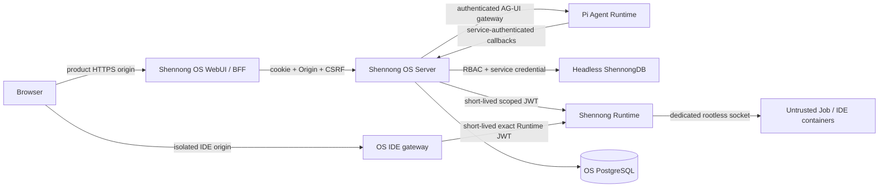

# Shennong V1 冻结架构与验收契约

**状态：** Released (v1.0.0)
**发布日期：** 2026-07-18
**仓库：** `zerostwo/shennong-os`、`zerostwo/shennong-db`、`zerostwo/shennong-runtime`
**部署根目录：** `/srv/shennong.one`

本文档取代早期草案中以下设计：DB 自带 WebUI/Chat/Memory/身份、浏览器直连
DB 或 Runtime、自建 assistant-ui thread store、rootful Docker socket、任意镜像与
任意宿主挂载、单一全局版本号、所有服务共用一个容器，以及只描述“不可信代码”
但没有可执行隔离策略的部分。

## 1. V1 目标

Shennong V1 是一个面向生物医学研究的完整分析闭环：

```text
用户注册 / 登录
  → 创建私有 Project
  → 与垂直生物医学 Agent 对话
  → 选择或上传数据
  → Agent 生成计划并提交隔离任务
  → 持久化代码、日志、结果、证据与溯源
  → 用户通过 RStudio Server / JupyterLab 接管
  → 结果回到对话和 Project
```

V1 不宣称支持临床诊断、医疗器械、HIPAA、等保或其他受监管生产数据。它按
“用户彼此不信任、上传内容不可信、模型输出不可信、生成代码完全不可信”设计。

## 2. 冻结的组件边界

| 组件 | V1 事实来源 | 明确不负责 |
| --- | --- | --- |
| Shennong OS | 用户、邀请、会话、Project/RBAC、Thread、Message、Run、Plan、Job 映射、Artifact 索引、Memory、Skill、Provider、审计 | 执行任意代码、保存 DB 原始数据 |
| Shennong Agent Runtime | Pi Agent 推理循环、提示词编译、工具选择、AG-UI 事件、科学结果验证 | 用户身份、长期状态、文件系统、Shell、Docker、任意网络工具 |
| Shennong Runtime | 批任务、日志、取消/超时、RStudio、JupyterLab、隔离执行日志 | 用户登录、Project 权限、对话、模型配置、长期科学事实 |
| ShennongDB | Resource、不可变 revision、Artifact、Relation、Research Graph、查询、存储和数据溯源 | WebUI、注册、Chat、Memory、AI Provider、Project 成员权限 |

浏览器只访问 Shennong OS 的产品 origin，以及由 OS 控制、与产品 cookie 隔离的
IDE 专用 origin。DB、Runtime、Agent Runtime、PostgreSQL 和 IDE target 均不直接
暴露给浏览器或公网。



## 3. 信任区与威胁模型

### 3.1 不可信输入

- 所有普通用户和跨 Project 请求；
- 上传文件、压缩包、notebook、数据表和元数据；
- Dataset 描述、网页内容、论文文本和工具返回；
- LLM 输出、Tool arguments、生成代码和依赖声明；
- Runtime 日志、Artifact 文件名和渲染内容；
- 自定义 Skill 内容。

这些内容不能决定服务 URL、密钥、镜像、宿主挂载、Docker HostConfig、网络策略、
系统提示词、可用工具或 Project 授权。

### 3.2 服务间凭据

- 浏览器只持有 opaque、HttpOnly、可撤销的 OS session cookie；
- CSRF 使用同源 Origin 检查和独立 double-submit token；
- OS → DB 使用独立 DB service key；
- OS → Runtime 使用 Ed25519 私钥签发短时、带 issuer/audience/scope 的 JWT，
  Runtime 只持有公钥；
- OS ↔ Agent Runtime 使用两组独立 service secret；
- Provider API key 只在 OS 加密保存，并按单次 Run 临时提供给 Agent Runtime；
- secret 生产环境从 `root:<专用 secrets 组>`、权限为 `0640` 的文件读取；只有明确
  需要该 secret 的容器获得补充组，不放入 Git、前端 bundle 或普通日志。

任何 service token 都不能作为用户身份使用，不能跨服务复用。

## 4. 身份、首次启动与注册

### 4.1 首个管理员

1. OS 数据库没有管理员时，`GET /api/v1/setup/status` 返回 `needs_setup=true`；
2. WebUI 自动进入 setup 表单；
3. 部署脚本生成一次性 bootstrap token，保存在 `/srv/shennong.one/secrets/`；
4. `POST /api/v1/setup/admin` 必须同时提交显示名、邮箱、密码和 bootstrap token；
5. 服务端使用 PostgreSQL advisory/row lock 和单事务再次检查管理员数量；
6. 只允许一个并发请求成功，bootstrap token 随成功事务失效；
7. 日志只记录成功/失败事件，不记录 token 或密码。

“第一个提交注册表单的人自动成为管理员”不构成安全边界；部署者持有的一次性 token
才构成首次所有权证明。

### 4.2 后续注册

- 注册页面可以公开访问；
- V1 默认策略为 `invite_only`；
- 管理员创建邀请时明文 code 只返回一次，数据库仅保存 HMAC digest 和短前缀；
- 邀请支持过期时间、最大使用次数、可选邮箱约束和撤销；
- 消费邀请和创建用户在同一事务中完成；
- 邀请永远不能指定管理员角色；
- 邮箱规范化并建立唯一约束；
- 登录、setup、注册和邀请消费有 IP/账号维度速率限制。

V1 密码使用 Argon2id。会话 token 只存 hash，支持失效、过期和全量撤销。

## 5. Project 与 RBAC

Project 默认私有。OS 是成员关系的唯一授权源。

| 操作 | owner | admin | editor | viewer |
| --- | ---: | ---: | ---: | ---: |
| 查看 Project、Thread、结果 | 是 | 是 | 是 | 是 |
| 创建 Thread、运行任务、写 Memory | 是 | 是 | 是 | 否 |
| 绑定 Resource、编辑 Project | 是 | 是 | 是 | 否 |
| 管理成员 | 是 | 是 | 否 | 否 |
| 删除/转移 Project | 是 | 否 | 否 | 否 |

平台管理员可以审计和恢复实例，但不能通过猜测 Project ID 绕过 handler 的显式策略。
所有 Project-scoped SQL 必须带 Project 条件；所有跨服务请求在 OS 检查 RBAC 后重签发
最小 scope，DB 和 Runtime 不接受用户自报的角色。

DB 中的 Research Project 只是研究图与溯源记录，通过
`/api/v1/research-projects/*` 访问，不保存 OS membership。OS 在 Project
创建/更新后尽力执行幂等 shadow 同步；每次 Project-scoped 数据平面请求前必须先完成
一次同步，因此 DB 短暂不可用期间创建的 Project 会自动修复，同时 DB shadow 永远不是
身份或授权来源。

## 6. WebUI、assistant-ui 与 AG-UI

V1 迁移原 ShennongDB WebUI 的视觉系统和 Resource 管理体验到 `shennong-os/apps/web`。
DB 不再构建或启动 WebUI。

前端采用：

- Next.js 15；
- assistant-ui；
- `@assistant-ui/react-ag-ui` 的原生 AG-UI runtime；
- 原生 history adapter；
- 原生 experimental thread-list adapter；
- 原生 interrupt hooks；
- 一层很薄的 Shennong compatibility adapter。

实验接口未来变化时直接跟随 upstream 修改 compatibility adapter，不另造一套线程模型。
OS PostgreSQL 始终是 Thread、Message、Run 和 event cursor 的事实来源。

```text
GET    /api/v1/threads
POST   /api/v1/threads
GET    /api/v1/threads/{id}
PATCH  /api/v1/threads/{id}
DELETE /api/v1/threads/{id}
GET    /api/v1/threads/{id}/messages
POST   /api/v1/threads/{id}/messages   (idempotent)
GET    /api/v1/threads/{id}/runs/active
GET    /api/v1/runs/{id}/events?after={cursor}
GET    /api/v1/runs/{id}/events/stream (SSE replay/follow)
POST   /api/v1/agent                   (AG-UI SSE gateway)
```

Agent Gateway 必须先完成用户 session、Origin、CSRF、Thread ownership/Project RBAC 校验，
然后才可注入内部 Agent secret。Next.js BFF 不能直接用 service secret 绕过 OS 授权。

AG-UI event 持久化后再向浏览器输出 cursor。assistant-ui history adapter 的 `resume()`
只连接已有 Run 的 Project-authorized replay/follow SSE，不调用新 Run gateway；网络中断后
按最后已应用的 `Last-Event-ID` 继续，重复边界帧会被丢弃。取消、interrupt、tool approval
和 Run 终态均是 durable state，而不是浏览器内存状态。

原生 assistant-ui `submitInterruptResponses()` 只提交一个 `resume[]` 响应和新的 `runId`。
OS 不信任浏览器提供 lineage：它在同一事务中按 session 用户、Project、Thread 和
interrupt id 锁定 pending approval，从持久化记录解析 original Run，并创建带
`parent_run_id` 的 child Run。批准只把原始 tool name、risk、arguments 和 digest 注入
child bootstrap；拒绝不运行 provider 或工具；过期、篡改、重复响应和已经消费的
execution token 全部失败。事件依旧遵循先写 PostgreSQL、后输出 cursor，因此刷新后
`RUN_FINISHED.outcome.interrupts` 可恢复相同的原生审批界面。

## 7. 生物医学 Pi Agent Harness

通用 Agent loop 不足以安全完成垂直生物医学分析。V1 harness 固定加入：

- 平台安全提示词、研究方法提示词、Project 上下文和 Skill 的分层编译；
- 数据类型、物种、assay、参考基因组、样本/患者单位和统计设计的前置检查；
- 将 Resource 元数据、论文、上传内容和工具结果放进显式 untrusted/tainted 边界；
- 只加载服务端注册的工具，忽略客户端传入的 tools/state/context/backend URL；
- 工具调用前进行 capability、Project RBAC、argument digest 和单次 execution token 校验；
- 科学计算后必须运行确定性 validator；
- 结论引用 backend-issued `EvidenceRef`，不能由模型自造；
- 缺 Provider、缺 Evidence、验证失败和 Runtime 失败产生结构化 `RUN_ERROR`，禁止假成功；
- Provider 请求拒绝重定向、DNS rebinding、私网/loopback/link-local/metadata 目标；
- 本地 Ollama 只有管理员显式配置的固定端点例外。

Agent Runtime 自身不挂载 Project 目录、不包含 Shell、不连接 Docker socket，也不直接连接
DB/Runtime；所有操作回到 OS callbacks。

## 8. Skills V1

每个 Skill 目录包含 `SKILL.md` 和 `shennong.skill.yaml`。manifest 至少包含：

```yaml
id: string
version: semver
content_digest: sha256
permissions: []
inputs: {}
outputs: {}
validators: []
```

V1 内置七个 Skill：

1. 初始化生物医学 Project；
2. 检查生物医学输入；
3. 发现 Shennong 数据；
4. 运行 Shennong 单细胞工作流；
5. 管理分析结果；
6. 解读生物医学结果；
7. 验证生物医学分析。

Skill 版本不可变；启用记录绑定 thread/project/user；权限是声明上限，不会自动授予工具。
发布新版本必须通过 schema、digest、权限、输入输出、prompt-injection fixture、结果验证和
forward test。自定义 Skill V1 不能新增任意 Shell 或网络能力。

## 9. ShennongDB V1

生产默认 `SHENNONG_DB_PROFILE=headless`：

- 只开放明确的数据 path/method allowlist；
- 所有数据 API 需要内部 service key；
- auth/users/chat/memory/AI provider/agent skill/grant/collection/favorite/legacy Project
  路由不可达；
- 健康、就绪、版本和指标端点供 orchestrator 使用；
- WebUI 和 DB-local Agent Runtime 不进入生产镜像；
- 兼容源码先保留，待 OS 迁移回滚验证后在独立提交清理。

Resource revision 是不可变线性链：revision 1 无 parent，revision N 必须指向 N-1。
Artifact 保存 checksum、content digest、source、pipeline version、derived-from、schema 和
provenance。OS Artifact 记录引用 DB Artifact/Runtime output，而不是复制大对象。

## 10. Shennong Runtime V1

Runtime 只接受严格、`deny_unknown_fields` 的 `JobSpec`/`SessionSpec`。客户端不能提供：

- 任意 Docker image；
- 任意宿主路径或 bind mount；
- privileged、capability、device、host network 或 host PID；
- 公网端口；
- 任意 seccomp/AppArmor 设置。

服务端 profile 将逻辑名称映射到 digest-pinned 镜像和资源上限。

### 10.1 Rootless Docker

- 使用专用宿主用户和专用 rootless dockerd；
- Runtime 只挂载该用户的 socket，永不挂载 `/var/run/docker.sock`；
- rootless daemon 开启 linger，由 systemd user unit 管理；
- job/IDE 容器强制 non-root、`cap_drop=ALL`、`no-new-privileges`、read-only rootfs、
  默认 seccomp、PIDs/CPU/memory/timeout/tmpfs 限制、空 device/host bind；
- Project workspace 通过服务端解析的受控根路径映射，拒绝 symlink/path traversal；
- 每个用户/Project/Session 独立目录和容器身份。

### 10.2 联网策略

V1 允许所有 Job/IDE 访问公共互联网，但：

- 阻断 IPv4/IPv6 loopback、RFC1918/ULA、link-local、multicast、cloud metadata；
- 阻断 OS、DB、Runtime control endpoint 和宿主/LAN；
- 阻断容器入站和端口发布，IDE 的例外只绑定宿主 `127.0.0.1`；
- DNS 仅允许指定 resolver，重定向和解析后地址再次校验；
- egress policy 由宿主 nftables/cgroup 规则执行，容器内规则不作为安全边界；
- 验收同时测试可访问公共 HTTPS、不可访问所有私网/metadata/control 地址。

### 10.3 RStudio 与 JupyterLab

IDE image 同时提供 RStudio Server 和 JupyterLab。Session 不返回 target URL，只返回
OS 可使用的 `proxy_path`。rootless Docker 将 IDE 随机端口仅绑定到专用 worker 宿主的
`127.0.0.1`；Runtime daemon 对 session ownership/JWT 再验证后代理 HTTP/WebSocket。

IDE 必须使用与产品 host 不同的受限 origin。OS 在产品 origin 完成 session 与 Project
RBAC 后只签发短期、一次性 launch ticket；IDE origin 将其兑换为该 host 独有的
HttpOnly、SameSite=Strict cookie，再使用精确 scope/workspace 的短期 Runtime JWT 代理。
IDE gateway 不转发产品 Cookie，并在 IDE host 拒绝普通 OS API，防止工作负载页面利用
同源权限读取或修改 OS 数据。随机 target 端口不监听 LAN/公网，也不能被视为认证边界。

Session 有 idle timeout、absolute lifetime、stop 和审计记录。关闭 Session 后端口和
container 必须回收。

## 11. 持久化与状态机

### 11.1 Agent Run

```text
created → running → waiting_for_tool/interrupt → running
        → succeeded | failed | cancelled | failed_validation
```

消息、事件、plan、tool decision 和终态先写 OS PostgreSQL，再向 UI 确认。

### 11.2 Runtime Job

```text
queued → preparing → running → succeeded | failed | cancelled | timed_out | lost
```

Runtime 使用 SQLite journal 恢复 daemon 重启前的 job/session 状态；OS 保存面向用户的
映射和审计。创建接口要求 idempotency key。

### 11.3 Artifact / Evidence

每个结果至少关联：

- Project、Run、Job；
- 创建者（用户/Agent/软件）；
- 输入 Resource revision / Artifact digest；
- 镜像 digest、Skill version、代码 digest、参数；
- 输出 digest、格式、schema、时间和 validator 结果；
- 可引用的 EvidenceRef。

## 12. 部署拓扑

`/srv/shennong.one` 包含：

```text
compose.yaml
.env                         # 非敏感配置
secrets/                     # 0700，文件 root:<专用组> 0640
data/os-postgres/
data/db/
data/runtime/                # Runtime journal，不是不可信 workspace
versions.env                 # 三仓独立版本/镜像 digest
```

不可信 Project workspace 使用专用 rootless Docker daemon 中带 Runtime/Project 标签的
named volume；该 daemon 的 data-root 位于独立的 ext4 硬上限挂载中，不把宿主任意路径
作为 workload bind mount 暴露给容器。

可信服务可以使用系统 Docker；不可信代码只能进入专用 rootless daemon。生产端口只发布
WebUI。DB、OS server、Agent Runtime、PostgreSQL 和 Runtime control API 只在内部/control
地址监听。各仓库独立版本和 digest，不使用一个 `SHENNONG_VERSION` 同步覆盖三者。

部署脚本必须：

1. 检查目录 owner/mode 和磁盘；
2. 生成缺失 secret，不覆盖已有 secret；
3. 安装/验证 rootless daemon、subuid/subgid 和 linger；
4. 应用 egress policy；
5. 构建或拉取 digest-pinned 镜像；
6. 运行数据库 migration；
7. 按依赖顺序启动服务；
8. 完成健康、注册、隔离和浏览器 smoke test；
9. 把一次性 bootstrap token 的路径告知部署者，不输出到容器日志。

## 13. 可观测性、备份与恢复

- 所有服务输出结构化日志和 request/run/job/session correlation ID；
- 密钥、cookie、Provider key、完整 prompt 私密内容和上传正文不得写日志；
- 健康与 readiness 分离；
- 记录 auth、邀请、RBAC、tool、job、session、artifact、Skill 发布和管理员操作审计；
- OS PostgreSQL、DB `/data`、Runtime journal 和 Project workspace 分别备份；
- 恢复演练必须验证 revision/artifact digest 和 Project 隔离，不只验证容器启动。

## 14. V1 发布门禁

以下条件必须全部通过才称为 V1：

### 身份与授权

- 空数据库 setup 跳转；正确 token 仅一个并发请求成功；错误/重放 token 失败；
- 邀请创建、一次展示、消费、次数、邮箱、过期、撤销和并发测试；
- 普通用户不能成为 admin；
- owner/admin/editor/viewer 正向与反向矩阵；
- 跨用户、跨 Project ID 猜测全部失败。

### Agent 与 Skills

- assistant-ui 创建/切换/重命名/归档 Thread；history 可恢复；interrupt 可继续；
- AG-UI SSE 断线按 cursor 重放且不重复消息；
- client-supplied tools/state/context 被忽略；
- 无 Provider 和 Provider 失败产生结构化失败；
- 七个 Skill schema/digest/permissions/forward test 通过；
- prompt injection fixture 不能修改系统工具或泄露 secret；
- 科学结论缺 Evidence/validator 时不能成功。

### DB

- headless allowlist 正向测试；auth/chat/memory/provider/user/legacy Project 反向测试；
- service key 缺失/错误失败；
- revision 线性、冲突、不可变测试；
- Resource query/upload/artifact/provenance 集成测试。

### Runtime

- Job success/failure/cancel/timeout/idempotency/restart recovery；
- HostConfig 断言：rootless socket、non-root、cap drop、read-only、no devices/binds/ports；
- 公共 HTTPS 成功；loopback/private/LAN/metadata/control IPv4/IPv6 全失败；
- RStudio/Jupyter 只能经 OS 的隔离 IDE origin 打开，产品 Cookie 不出现在 IDE 请求中，
  stop 后 target 不可达；
- 两个互不信任用户的 workspace、process、log 和 Artifact 不能互读。

### 产品与运维

- Web 单测、typecheck、lint、production build；
- desktop 1512×801 与 mobile 浏览器视觉/交互 QA；
- 三仓 Rust/TypeScript 测试、clippy、OpenAPI 校验；
- 三个生产镜像构建和健康检查；
- `/srv/shennong.one` 实际部署、重启和最小恢复测试；
- changelog、版本、commit、push 与远端 CI 状态清晰。

## 15. 明确延期到 V2

- 临床诊断或医疗合规承诺；
- Kubernetes、多节点调度、GPU 多租户和跨机共享存储；
- 第三方 OAuth/SSO、邮件找回、强制 MFA；
- 付费、配额市场和公共 Skill 市场；
- 允许用户自定义任意 Docker image、Shell capability 或任意网络策略；
- 从 DB 仓库物理删除全部迁移源代码（V1 先从生产构建和路由移除）。

这些延期项不能通过隐藏配置在 V1 绕过当前安全边界。
