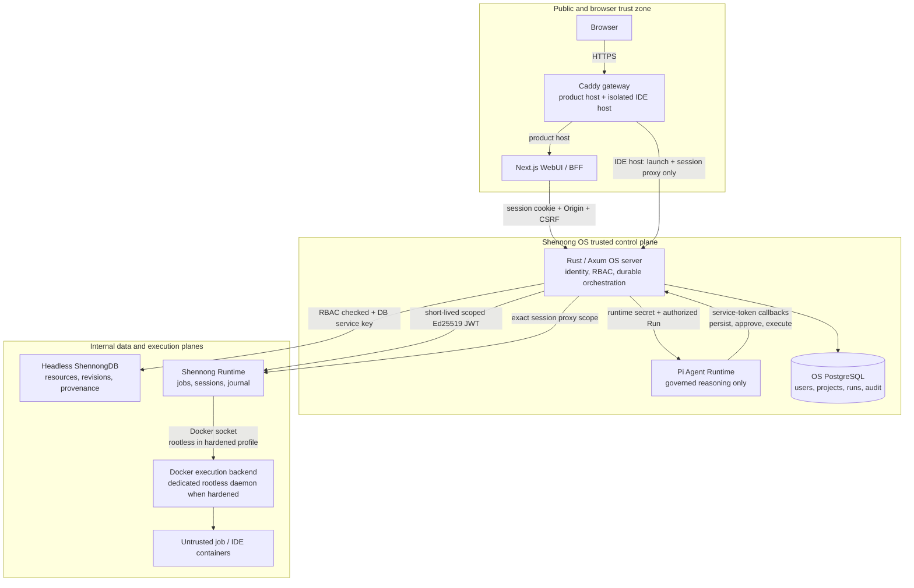

# Shennong OS

Shennong OS is the unified control plane and WebUI for the Shennong biomedical
analysis platform. Version 1.0.0 owns identity, invitation-based registration,
Projects and membership, assistant-ui/AG-UI conversations, Pi Agent runs,
Skills, Memory, jobs, artifacts, provider credentials, and audited access to
ShennongDB and Shennong Runtime.

ShennongDB is a headless data plane. Shennong Runtime executes untrusted code
through Docker: the hardened profile uses a dedicated rootless daemon, while
the three-image quick deployment uses the host socket and is limited to trusted
single-user hosts. A browser only connects to the Shennong OS WebUI; DB,
Runtime, Agent Runtime, PostgreSQL, and IDE targets stay on internal networks.

Shennong OS is the sole authority for Project identity, lifecycle, membership,
and RBAC. It synchronizes an idempotent Project shadow to ShennongDB for research
graph and provenance foreign keys; ShennongDB never uses that shadow as an
authorization source. Project data-plane calls perform a lazy synchronization
first so projects created while DB was unavailable self-heal.

## Architecture at a glance



The diagram shows logical trust boundaries; the default OS image co-locates the
gateway, Web, server, Agent, and PostgreSQL processes without merging their
credentials or responsibilities. The arrows are security boundaries, not just
network connections. The browser
never receives service credentials, Agent Runtime cannot call DB or Runtime
directly, and OS never receives a Docker socket. In the quick profile only the
Runtime container receives the host socket; this weakens workload isolation and
is not the hardened production boundary. Durable control-plane state is owned
by OS PostgreSQL; scientific catalog/provenance state is owned by ShennongDB;
execution recovery state is owned by Runtime. See
[`docs/architecture.md`](docs/architecture.md) for the request flows, state ownership,
failure modes, cross-repository contracts, and deployment invariants.

Uploads are available only inside an active Project. The Web BFF streams the
file through an exact allowlisted route; OS enforces session/CSRF and
editor-level Project access, strips ownership fields, and injects the
authenticated actor/Project UUIDs on the private DB request. Registration
always creates a private Resource and immutable Artifacts bound atomically to
that Project.

## V1 components

- `apps/web`: Next.js, assistant-ui, native AG-UI history/thread-list/interrupt
  adapters, Resource management, Projects, Compute, and administrator flows.
- `apps/server`: Rust/Axum control plane with PostgreSQL, Argon2id credentials,
  opaque revocable sessions, CSRF/origin checks, invitation policy, Project
  RBAC, durable Agent state, Ed25519 Runtime authorization, and typed internal
  service clients.
- `apps/agent-runtime`: Pi Agent Core biomedical harness. It has no filesystem,
  shell, Docker socket, or arbitrary backend tool access and delegates every
  privileged operation to authenticated OS callbacks.
- `skills`: versioned built-in biomedical Skills with validated manifests,
  explicit permissions, content digests, and result-validation contracts.
- `migrations`: the Shennong OS control-plane schema.
- `openapi`: the V1 HTTP contract.
- `deploy`: unified deployment assets for all three Shennong repositories.

### Agent runtime versions

The built-in Agent harness uses exact dependency pins so an OS image can be
audited without guessing the Pi stack from the OS release number:

| Component | Version |
| --- | --- |
| Shennong Agent Runtime | `1.0.0` |
| `@earendil-works/pi-agent-core` | `0.80.10` |
| `@earendil-works/pi-ai` | `0.80.10` |
| AG-UI core and encoder | `0.0.57` |
| Node.js / pnpm contract | `>=22` / `10.17.1` |

`apps/agent-runtime/package.json` and `apps/agent-runtime/pnpm-lock.yaml` are the
dependency source of truth. The Agent Runtime `/health` response reports Pi
Agent Core `0.80.10`; an upgrade must update that response, both dependency
files, the detailed architecture, and the changelog together.

V1 `project.list_files`, `project.read_file`, and `project.write_file` operate
only on bounded, OS-owned project text records. They never resolve a host path,
mount content, or execute it. `environment.plan` validates a declarative Pixi
package/channel plan without resolving packages; lock materialization remains
an explicit, isolated `cpu-small` Runtime job. Selecting a Skill is what grants
its additional tools, URI scopes, and compute profile to an Agent run.

AG-UI delivery is resumable without re-running the model. The control plane
stores each event before exposing its numeric cursor; authenticated clients can
list or follow only events belonging to an authorized Project Run. The
assistant-ui history adapter implements `resume()` by replaying from cursor zero
and, after a transport break, reconnecting strictly after the last applied SSE
`id` until `RUN_FINISHED`, `RUN_ERROR`, or `RUN_CANCELLED`.
`RUN_FINISHED` interrupt outcomes are rehydrated into assistant-ui's native
`requires-action` metadata, so refresh and reconnect preserve the approval UI.
Approving or rejecting creates a fresh child Run whose `parent_run_id` is
resolved from the persisted interrupt; the browser cannot choose the parent,
arguments, digest, tool, or approval scope. Approved execution tokens are
short-lived, exact-argument-bound, and consumed once.

## Registration

On an empty database, `/api/v1/setup/status` reports that bootstrap is needed.
The first administrator must present the one-time deployment bootstrap token;
the transaction is serialized so concurrent requests cannot create a second
first administrator. After bootstrap, registration defaults to `invite_only`.
An administrator creates an invitation and its plaintext value is returned
once; only a keyed digest is stored.

## Local verification

```bash
cd apps/server
cargo fmt --all -- --check
cargo clippy --locked --all-targets --all-features -- -D warnings
cargo test --locked --all-targets

cd ../agent-runtime
pnpm install --frozen-lockfile --ignore-scripts
pnpm test
pnpm typecheck
pnpm skills:validate
pnpm build

cd ../web
pnpm install --frozen-lockfile
pnpm test
pnpm typecheck
pnpm lint
pnpm build
```

See [`docs/README.md`](docs/README.md) for the documentation index,
[`deploy/SIMPLE.md`](deploy/SIMPLE.md) for the default three-image quick
deployment and [`deploy/README.md`](deploy/README.md) for the retained hardened
profile. [`docs/architecture.md`](docs/architecture.md) is the frozen V1 architecture,
security model, and acceptance contract; [`openapi/os-api.yaml`](openapi/os-api.yaml)
is the browser and service-facing OS HTTP contract. Repository automation and
change conventions are documented in [`AGENTS.md`](AGENTS.md).

## License

Shennong OS is licensed under the [Apache License 2.0](LICENSE).
