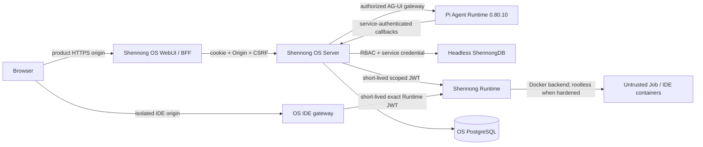
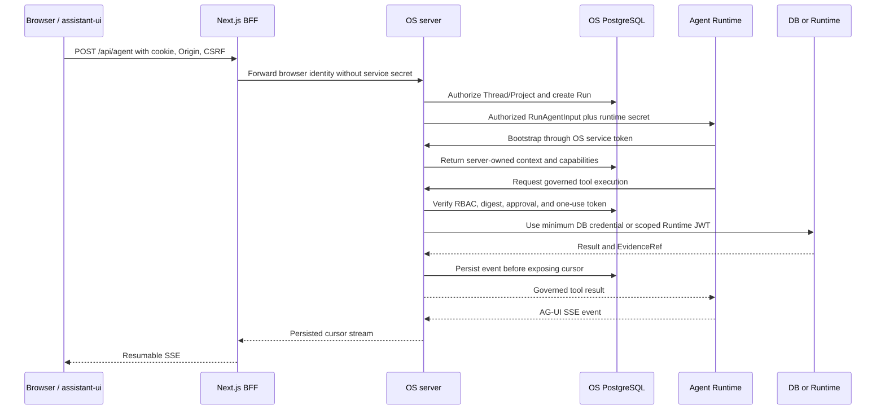

# Shennong V1 architecture and acceptance contract

**Status:** Released (`v1.0.0`)

**Release date:** 2026-07-18

**Repositories:** `zerostwo/shennong-os`, `zerostwo/shennong-db`, and
`zerostwo/shennong-runtime`

**Deployment root:** `/srv/shennong.one`

This document records the released V1 architecture, trust boundaries, and
acceptance contract. It is not a future roadmap. The implementation source of
truth is the current repository, especially `apps/server/src/lib.rs`,
`apps/agent-runtime/src/server.ts`, `apps/web/app/api/`, `openapi/os-api.yaml`,
and `deploy/compose.yaml`. Cross-repository behavior must also satisfy the
versioned DB and Runtime APIs. When documentation and implementation diverge,
fix both in the same change and record it in `CHANGELOG.md`.

This contract supersedes early drafts in which DB owned a WebUI, chat, memory,
or identity; browsers connected directly to DB or Runtime; OS implemented a
parallel assistant-ui thread store; Runtime used an unrestricted rootful Docker
socket, arbitrary images, or arbitrary host mounts; the three repositories
shared one global version; or untrusted code was described without an
enforceable isolation policy.

## 1. V1 outcome

Shennong V1 provides a complete biomedical-analysis loop:

```text
register or sign in
  -> create a private Project
  -> work with a biomedical Agent
  -> select or upload data
  -> review the plan and submit an isolated job
  -> persist code, logs, results, evidence, and provenance
  -> take over in RStudio Server or JupyterLab
  -> return results to the conversation and Project
```

V1 does not claim clinical-diagnostic, medical-device, HIPAA, MLPS, or other
regulated-data compliance. Its baseline assumption is that users do not trust
one another and that uploads, model output, generated code, and dependency
hooks are untrusted.

## 2. Frozen component boundaries

| Component | Owns in V1 | Explicitly does not own |
| --- | --- | --- |
| Shennong OS | Users, invitations, sessions, Project/RBAC, Threads, Messages, Runs, Plans, Job mappings, Artifact indexes, Memory, Skills, Providers, and audit | Arbitrary code execution or raw DB scientific data |
| Shennong Agent Runtime | Pi Agent reasoning loop, prompt compilation, tool selection, AG-UI events, and scientific-result validation | User identity, durable state, filesystem, shell, Docker, or arbitrary network tools |
| Shennong Runtime | Batch Jobs, logs, cancellation/timeouts, RStudio, JupyterLab, isolation, and execution journal | Login, Project authorization, chat, model configuration, or durable scientific facts |
| ShennongDB | Resources, immutable revisions, Artifacts, Relations, Research Graph, queries, storage, and provenance | WebUI, registration, chat, Memory, AI Providers, or Project membership authorization |

The browser reaches only the Shennong OS product origin and an OS-controlled,
cookie-isolated IDE origin. DB, Runtime, Agent Runtime, PostgreSQL, and raw IDE
targets remain private.



### 2.1 Code and deployment map

| Responsibility | Implementation entry point | Default three-image deployment |
| --- | --- | --- |
| Product WebUI and browser BFF | `apps/web`, `apps/web/app/api/v1/[...path]/route.ts`, `apps/web/app/api/agent/route.ts` | Web process inside `zerostwo/shennong-os` |
| Identity, RBAC, durable state, authorization, and mediation | `apps/server/src/lib.rs`, `apps/server/src/handlers/` | Server process inside `zerostwo/shennong-os` |
| Pi Agent loop and prompt/taint/tool/validator policy | `apps/agent-runtime/src/server.ts`, `harness.ts`, `tool-policy.ts` | Agent process inside `zerostwo/shennong-os` |
| OS source-of-truth database | `migrations/` and Rust `sqlx` queries | PostgreSQL process and `/data` inside `zerostwo/shennong-os` |
| Product/IDE host routing boundary | `deploy/container/Caddyfile` | Caddy process inside `zerostwo/shennong-os` |
| Cross-repository deployment contract | `deploy/compose.yaml`, `deploy/README.md` | OS plus the DB and Runtime images |

The unified OS image is a distribution and supervision boundary, not a merger
of logical trust zones. Web/BFF still does not receive service secrets, Agent
Runtime still cannot connect directly to DB or Runtime, and the OS server does
not receive a Docker socket. The hardened profile may split these processes
without changing protocol or state ownership.

### 2.2 Agent stack versions

| Component | V1 version | Source of truth |
| --- | --- | --- |
| Shennong Agent Runtime package | `1.0.0` | `apps/agent-runtime/package.json` |
| Pi Agent Core | `@earendil-works/pi-agent-core` `0.80.10` | exact manifest and lockfile pin; `/health` reports the same version |
| Pi provider layer | `@earendil-works/pi-ai` `0.80.10` | exact manifest and lockfile pin |
| AG-UI core and encoder | `0.0.57` | exact manifest and lockfile pins |
| Node.js contract | `>=22` | `apps/agent-runtime/package.json` `engines` |
| pnpm contract | `10.17.1` | `apps/agent-runtime/package.json` `packageManager` |

Do not infer the Pi Agent version from the OS release number. Upgrade the
manifest, lockfile, health response, this table, and changelog together.

### 2.3 Cross-repository contracts

| Caller -> service | Contract and identity | OS invariant |
| --- | --- | --- |
| Web/BFF -> OS server | `openapi/os-api.yaml`; browser session, Origin, and CSRF | BFF forwards only allowlisted methods and paths and never injects a service secret |
| OS server -> Agent Runtime | AG-UI `RunAgentInput` plus SSE and a dedicated runtime secret | OS authorizes and creates the Run first; client tools/state/context are untrusted |
| Agent Runtime -> OS server | `/api/v1/agent/runs/*` callbacks and a dedicated OS service token | Persistence, capabilities, approvals, and privileged tools remain in OS |
| OS server -> ShennongDB | Headless data API and DB service key | OS performs Project RBAC and shadow synchronization before an exact allowlisted call |
| OS server -> Shennong Runtime | Runtime V1 API and OS-issued short-lived Ed25519 JWT | Claims bind user, Project, scope, and profile; clients cannot choose images, host paths, or Docker settings |

Each repository uses its own SemVer. A breaking cross-repository change needs a
compatibility window or coordinated upgrade note. `deploy/versions.env` and
image digests describe one deployment composition; they do not create a shared
product version.

## 3. Trust zones and threat model

Untrusted inputs include users and cross-Project requests; uploads, archives,
notebooks, tables, and metadata; resource descriptions, papers, and web
content; LLM output, tool arguments, generated code, and dependency hooks;
Runtime logs and Artifact names; and custom Skill content.

None of those inputs may select service URLs, credentials, images, host mounts,
Docker HostConfig, network policy, system prompts, tool availability, or
Project authorization.

Service credentials are separated by purpose:

- the browser holds only an opaque, HttpOnly, revocable OS session cookie;
- CSRF uses same-origin checks plus an independent double-submit token;
- OS uses a dedicated DB service key;
- OS signs short-lived issuer/audience/scope Runtime JWTs with Ed25519, while
  Runtime mounts only the public key;
- OS and Agent Runtime use two independent service secrets;
- Provider keys are encrypted by OS and exposed to Agent Runtime only for the
  relevant Run;
- production secret files are root-owned, readable only by the dedicated
  secrets group, and never enter Git, frontend bundles, or normal logs.

A service credential is never a user identity and is never reused across
services.

## 4. Identity, bootstrap, and registration

When no administrator exists, `/api/v1/setup/status` returns
`needs_setup=true`. The deployment produces a one-time bootstrap token. Setup
requires that token plus the administrator profile and password, serializes the
administrator-count check in one transaction, allows exactly one concurrent
winner, invalidates the token on success, and never logs secrets.

After bootstrap, registration defaults to `invite_only`. Invitation plaintext
is returned once; only an HMAC digest and short prefix are stored. Invitations
support expiry, usage limits, optional email binding, and revocation. Consuming
an invitation and creating the user are one transaction, invitations cannot
grant administrator status, email is normalized and unique, and setup/login/
registration endpoints are rate-limited. Passwords use Argon2id; session tokens
are stored only as hashes and support expiry and revocation.

## 5. Project authorization

Projects are private by default and OS is the sole membership authority.

| Operation | owner | admin | editor | viewer |
| --- | ---: | ---: | ---: | ---: |
| Read Project, Thread, and results | yes | yes | yes | yes |
| Create Threads, run work, and write Memory | yes | yes | yes | no |
| Bind Resources and edit the Project | yes | yes | yes | no |
| Manage members | yes | yes | no | no |
| Delete or transfer Project | yes | no | no | no |

Every Project-scoped SQL query includes a Project predicate. Every service call
is authorized in OS before a minimum-scope credential is issued. DB's Research
Project record is a graph/provenance shadow, never an authorization source. OS
performs idempotent shadow synchronization on writes and lazily before each
Project data-plane request, so a DB outage can self-heal without weakening RBAC.

## 6. WebUI, assistant-ui, and AG-UI

The WebUI uses Next.js 15, assistant-ui, `@assistant-ui/react-ag-ui`, native
history/thread-list/interrupt adapters, and a thin Shennong compatibility
adapter. OS PostgreSQL remains the source of truth for Threads, Messages, Runs,
and event cursors.



The gateway validates session, Origin, CSRF, Thread ownership, and Project RBAC
before injecting an internal Agent secret. Events are persisted before their
cursors are emitted. Reconnect replays/follows the existing Run and never
re-runs the model.

Approval lineage is server-owned. OS locks the pending interrupt, recovers the
original Run, and creates a child Run with the persisted tool name, risk,
arguments, and digest. Approval tokens are short-lived, argument-bound, and
single-use. Rejection does not call a provider or tool; expired, modified,
duplicated, or already-consumed responses fail closed.

## 7. Biomedical Pi Agent harness

The V1 harness adds layered platform/method/Project/Skill prompts; assay,
species, reference, sample-unit, and statistical-design preflight checks;
explicit untrusted-content boundaries; server-registered tools only;
capability/RBAC/digest/execution-token checks; deterministic validators;
backend-issued `EvidenceRef` citations; and structured failure for missing
providers, evidence, validation, or Runtime results.

Provider requests reject redirects, DNS rebinding, private, loopback,
link-local, and metadata destinations. Only an administrator-configured fixed
local Ollama endpoint is exempt. Agent Runtime has no Project mount, shell,
Docker socket, or direct DB/Runtime link; privileged operations return to OS.

## 8. Skills V1

Each Skill contains `SKILL.md` and `shennong.skill.yaml`. The manifest declares
an immutable SemVer, content digest, permission ceiling, inputs, outputs, and
validators. V1 ships seven governed Skills covering Project initialization,
input checks, data discovery, single-cell workflows, result management,
interpretation, and analysis validation.

Publishing requires schema, digest, permission, input/output,
prompt-injection-fixture, validator, and forward tests. Enabling a Skill binds
its version to a thread, Project, and user. Permissions are a ceiling, not an
automatic grant; custom V1 Skills cannot add arbitrary shell or network access.

## 9. ShennongDB boundary

Production defaults to `SHENNONG_DB_PROFILE=headless`. Only the explicit data
allowlist is reachable and every data route requires the internal service key.
Authentication, users, chat, memory, providers, skills, grants, collections,
favorites, and legacy Project routes are not exposed. Resources have immutable
linear revisions; Artifacts retain checksums, input derivation, schema, pipeline
version, and provenance. OS stores DB references and Project bindings, not
duplicate scientific blobs.

## 10. Shennong Runtime boundary

Runtime accepts strict `deny_unknown_fields` Job and Session specifications.
Clients cannot choose a Docker image, host path, bind mount, privileged mode,
capability, device, host network/PID, public port, or security profile. Server
profiles map logical names to digest-pinned images and resource ceilings.

Hardened deployments use a dedicated rootless daemon. Workloads are non-root,
drop all capabilities, use `no-new-privileges`, a read-only root filesystem,
default seccomp, private IPC, and CPU/memory/PID/time/tmpfs limits. Project paths
are server-resolved and reject symlinks and traversal. Host egress policy blocks
loopback, private/LAN, link-local, metadata, and control-plane addresses while
allowing public HTTPS.

The quick three-image profile gives only Runtime the host Docker socket. That
socket is host-administrative authority, so this profile is restricted to a
trusted single-user host and is not the hardened multi-user acceptance
boundary.

RStudio and JupyterLab targets bind only to container loopback and are reached
through an authenticated per-Session gateway. OS exchanges a short-lived,
single-use launch ticket on a separate IDE origin, then uses an exact-scope
Runtime JWT. The IDE gateway does not forward product cookies and rejects
normal OS APIs on the IDE host. Sessions enforce idle and absolute lifetimes,
auditable stop, and complete port/container cleanup.

## 11. State and lifecycle ownership

```text
Agent Run: created -> running -> waiting_for_tool/interrupt -> running
           -> succeeded | failed | cancelled | failed_validation

Runtime Job: queued -> preparing -> running
             -> succeeded | failed | cancelled | timed_out | lost
```

Messages, events, plans, tool decisions, and Agent terminal state are committed
to OS PostgreSQL before UI acknowledgement. Runtime uses its SQLite journal to
recover Job and Session supervision; OS keeps the user-facing mapping and
audit. Create operations require idempotency keys.

| State | Sole source of truth | Allowed mirror | Forbidden pattern |
| --- | --- | --- | --- |
| Users, sessions, invitations, Project membership/RBAC | OS PostgreSQL | Short-lived UI display cache | DB shadow or client role authorizes |
| Threads, Messages, Runs, cursors, approvals, Memory, Skill enablement | OS PostgreSQL | assistant-ui replay | Terminal state exists only in browser or Agent memory |
| Resources, revisions, DB Artifacts, Relations, graph, provenance | ShennongDB | OS references and Project binding | OS becomes a second blob store |
| Job/Session operational state and recovery journal | Runtime SQLite | OS product mapping and audit | Web or Agent controls containers directly |
| Workspace and workload containers | Runtime-managed volume/container; dedicated rootless daemon when hardened | Server-side profile resolution | Client supplies host bind, image, or HostConfig |

Every result links Project, Run, Job, creator, input revision/digest, image
digest, Skill version, code digest, parameters, output digest/schema/time,
validator result, and a citable `EvidenceRef`.

## 12. Deployment topology

| Profile | Long-lived containers | Docker boundary | Intended use |
| --- | --- | --- | --- |
| Default three-image quick deployment | `shennong-os`, `shennong-db`, `shennong-runtime` | Only Runtime mounts the host socket | Trusted single-user installation; not hardened multi-user production |
| Retained hardened rootless profile | OS logical processes, headless DB, Runtime control plane | Only Runtime connects to a dedicated rootless daemon | Mutually untrusted users, public service, formal acceptance |

The default OS image runs Caddy, Next.js, the Rust server, Agent Runtime, and
PostgreSQL on loopback, publishing only product and IDE-gateway ports through
Caddy. `deploy/compose.yaml` starts the three repository images, generates
shared service credentials and the Runtime public key under `/config`, and
keeps the Ed25519 private key only in OS. Persistent quick-profile state lives
under `./shennong-data/{config,os,db,runtime}`.

Hardened deployments use a dedicated rootless data root with a hard storage
ceiling and labeled named volumes, never arbitrary host binds. Only WebUI and
the IDE gateway are public. Both profiles record independent repository
versions and immutable image digests. Deployment must preserve existing
secrets, run migrations, start in dependency order, verify health plus browser
flows, and expose only the path—not the value—of the bootstrap token.

## 13. Observability, backup, and failure semantics

Services emit structured logs with request/run/job/session correlation IDs.
Secrets, cookies, provider keys, private prompt bodies, and uploaded content are
not logged. Readiness is separate from liveness. Audit covers authentication,
invitations, RBAC, tools, Jobs, Sessions, Artifacts, Skills, and administrator
actions. Backups independently cover OS PostgreSQL, DB data, Runtime journal,
deployment metadata/secrets, and explicitly selected Project workspaces.

| Failure | User-visible behavior | Recovery and security rule |
| --- | --- | --- |
| OS PostgreSQL unavailable | Login, RBAC, Runs, and writes fail closed | Never fall back to anonymous/client authorization; migrate and verify consistency after restore |
| Agent Runtime/provider unavailable | Run ends with a structured error | Existing history/cursors remain readable; retry as a new or controlled child Run |
| ShennongDB unavailable | Catalog, upload, graph, and provenance fail | Identity remains available; shadow sync self-heals without bypassing the service key |
| Runtime/Docker unavailable | New Jobs/Sessions fail; active ones become failed/lost | OS never takes the socket; reconcile Runtime journal before retry |
| Browser/SSE disconnect | No model rerun | Replay/follow after the last cursor and deduplicate the boundary frame |
| IDE ticket/origin invalid | Access denied | Keep one-use expiry and redaction; normal OS API remains unavailable on IDE host |
| Cross-repository incompatibility | Readiness/acceptance fails | Roll back independent versions/digests; never bypass the contract gate |

## 14. V1 release gates

Release requires: serialized bootstrap and invitation tests; full positive and
negative RBAC matrices; cross-user/Project denial; assistant-ui thread history,
interrupt, and cursor-resume tests; rejection of client tools/state/context;
structured provider and validation failures; Skill schema/digest/permission/
injection/forward tests; DB headless allowlist and revision/provenance tests;
Runtime success/failure/cancel/timeout/idempotency/restart tests; locked
HostConfig assertions; public-egress and private/control denial; isolated IDE
origin and cleanup; cross-user workspace/log/Artifact denial; frontend test,
typecheck, lint, production build, desktop/mobile browser QA; all three
repositories' Rust/TypeScript/OpenAPI checks; production image health checks;
deployment restart and restore smoke tests; and complete changelog, commit,
push, and remote CI evidence.

## 15. Explicit V2 deferrals

V2 may address regulated clinical claims, Kubernetes or multi-node scheduling,
GPU multi-tenancy, shared storage, third-party OAuth/SSO, password recovery,
mandatory MFA, billing/marketplaces, user-defined images or shell capability,
arbitrary network policies, and physical removal of all migration-only legacy
DB sources. Hidden configuration must not use those deferrals to bypass V1
security boundaries.
